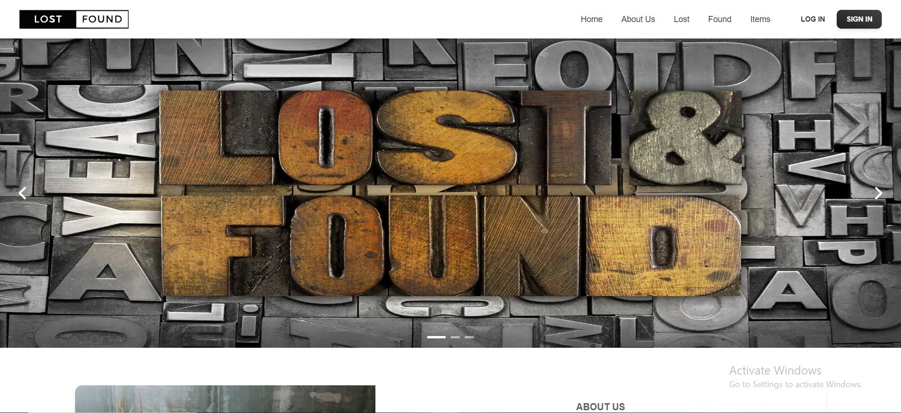
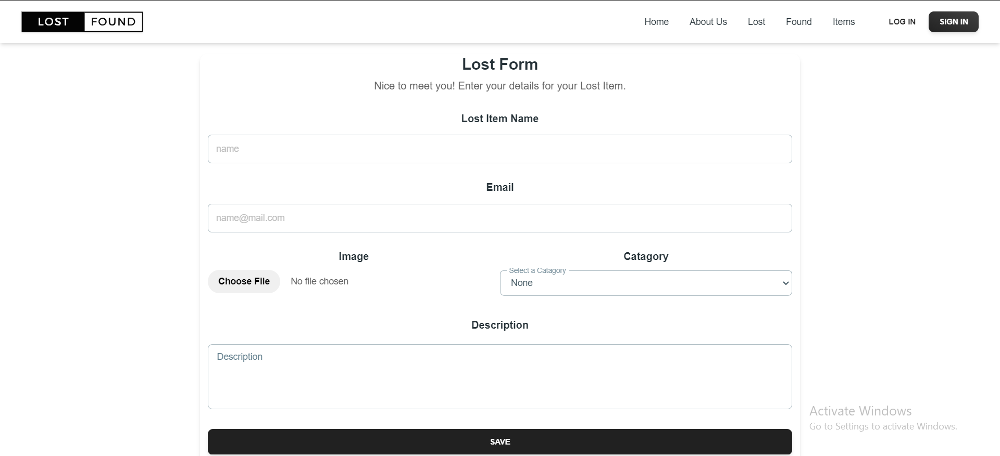
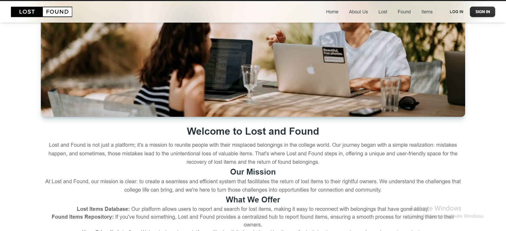

# Lost and Found Web Application

The Lost and Found Web Application is a platform designed to help users report lost items, search for found items, and facilitate their return to their rightful owners. This application is built using MERN stack (MongoDB, Express.js, React.js, Node.js) and provides a user-friendly interface for managing lost and found items.

## Features

- **User Authentication**: Users can sign up, log in, and log out securely to access the features of the application.
- **Reporting Lost Items**: Registered users can report lost items by providing details such as title, description, and type of item.
- **Finding Found Items**: Users can search for found items by type or keyword to check if their lost item has been found.
- **Item Details**: Detailed information about each item, including title, description, type, and creator.
- **Comments**: Users can add comments to the details of each item to provide additional information or ask questions.
- **Image Upload**: Option to upload images of lost or found items to provide visual information.
- **Administrator Privileges**: Certain functionalities, such as deleting items, are restricted to administrators.
- **Pagination**: Display of items in paginated lists for easier navigation.
- **Responsive Design**: The application is designed to be responsive and accessible on various devices and screen sizes.





## Installation

To run the Lost and Found Web Application locally, follow these steps:

1. **Clone Repository**: Clone this repository to your local machine using the following command:

   ```bash
   git clone https://github.com/yourusername/lost-and-found-web-app.git
2. **Install Dependencies**: Navigate to the project directory and install dependencies for both frontend and backend:
   ```bash
   cd client
   npm install
   cd ..
   cd server
   npm install
3. **Set Environment Variables**: Create .env files in both lost-and-found-backend and lost-and-found-frontend directories and configure environment variables as needed.
4. **Run Backend Server**: Start the backend server in lost-and-found-backend
   ```bash
   npm start
5. **Run Frontend Server**: Start the frontend development server in lost-and-found-frontend:
   ```bash
   npm run dev
6. **Access the Application**: Open example:- http://localhost:3000 in your web browser.

## Technologies Used

### Backend

- **Express.js**: Web application framework for Node.js, used to build the backend server.
- **MongoDB**: NoSQL database used for storing user data, items information, and other application data.
- **Mongoose**: Object Data Modeling (ODM) library for MongoDB and Node.js, used to interact with the MongoDB database.
- **JSON Web Token (JWT)**: Standard for creating access tokens used for user authentication and authorization.
- **Bcrypt/Bcryptjs**: Libraries for hashing passwords securely, used for user authentication and security.
- **Multer**: Middleware for handling multipart/form-data, used for handling file uploads.
- **Cors**: Middleware for enabling Cross-Origin Resource Sharing (CORS), allowing requests from other origins.

### Frontend

- **React**: JavaScript library for building user interfaces, used for frontend development.
- **React Router DOM**: Library for routing in React applications, used for navigation between different pages/components.
- **Tailwind CSS**: Utility-first CSS framework, used for styling the UI components.
- **Material-UI**: React UI framework, used for building UI components with Material Design style.
- **Headless UI**: Library for creating accessible and reusable UI components, used for building UI elements such as popover and collapse.

### Contributing
Contributions are welcome! If you find bugs or have suggestions, open an issue or submit a pull request.